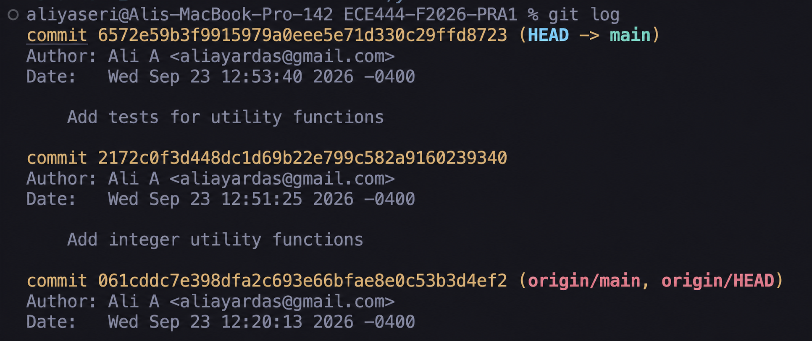
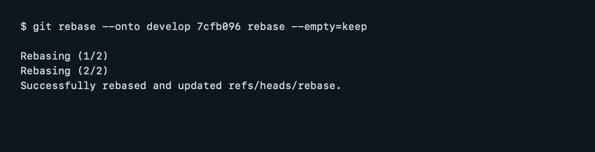
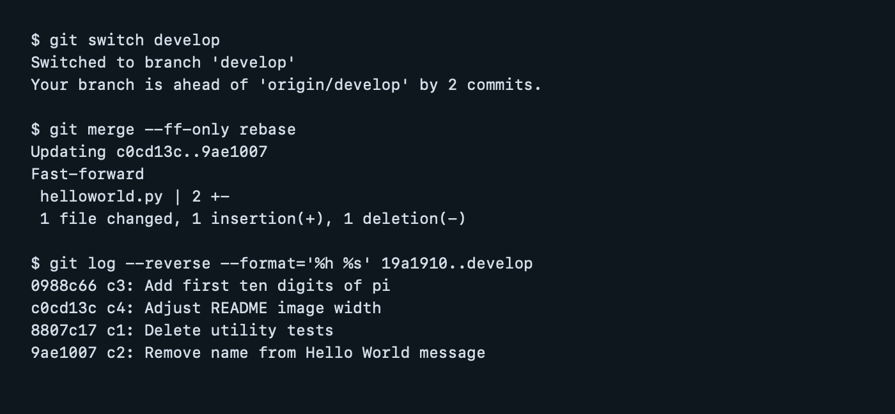
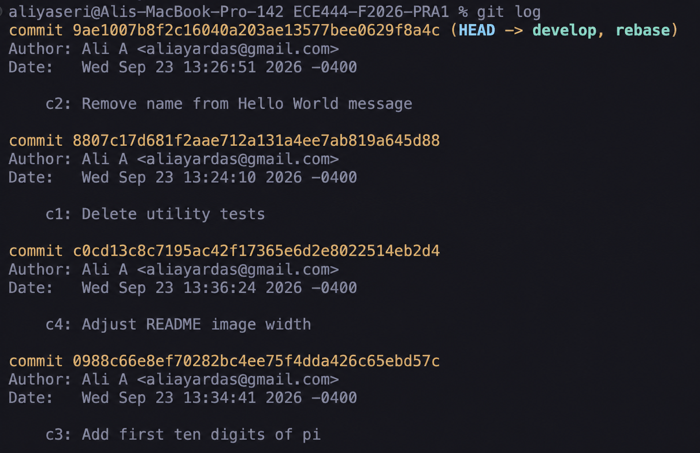

# ECE444-F2026-PRA1

Name: Ali Alyaseri

## Successful Merge

## Utility Function Commits

## Rebase

### Rebase Command

### Fast-forward and Commit Order Verification

### Final Rebased History

